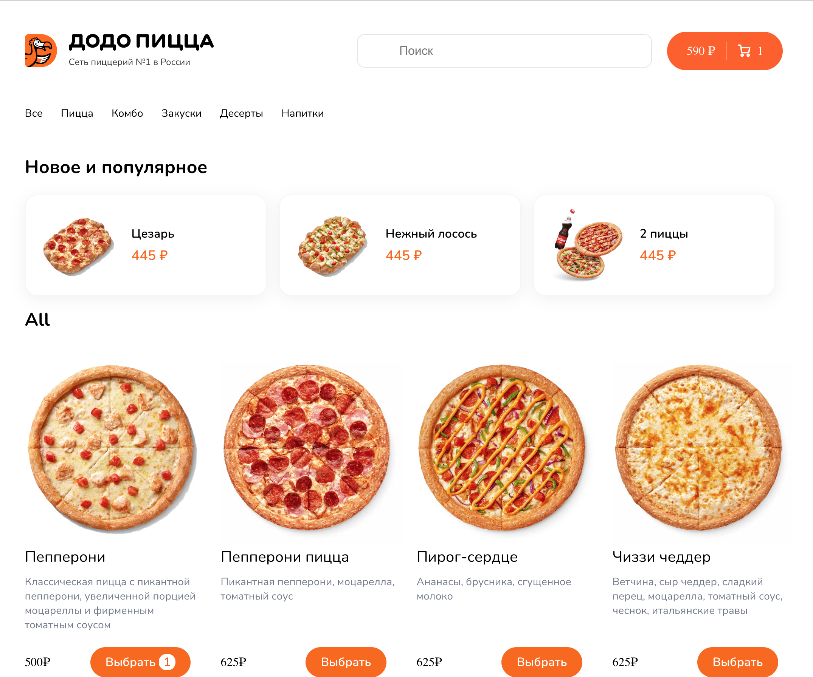
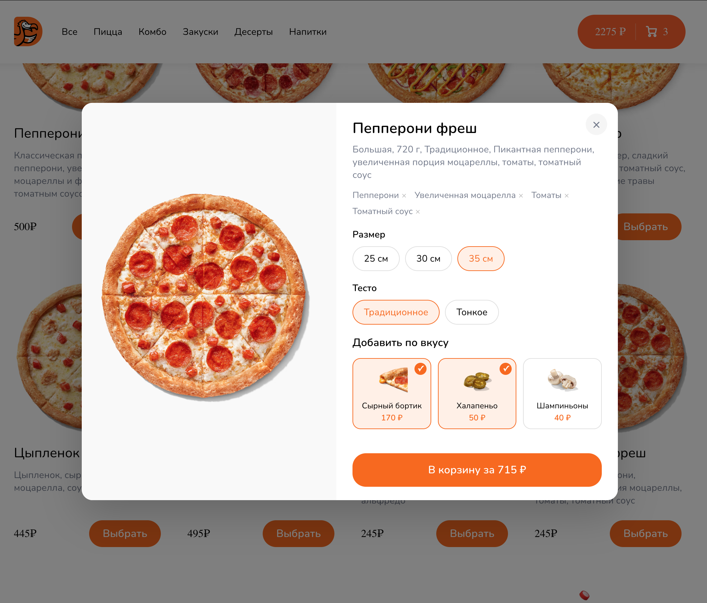
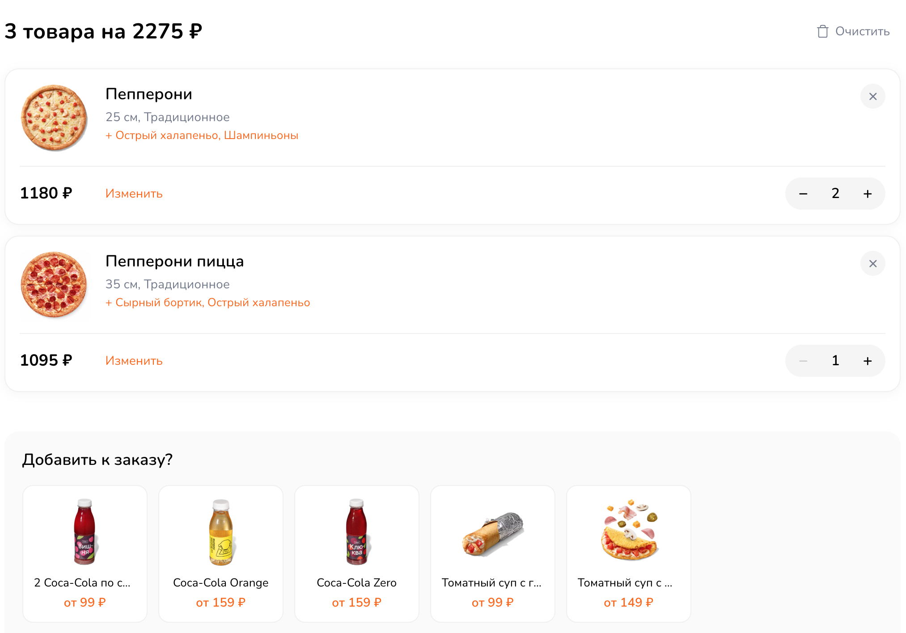

# 🍕 Pizza App — React + TypeScript

## Описание

Этот проект представляет собой веб-приложение для заказа пиццы по типу сервиса «Додо Пицца».
Пользователь может искать пиццы, настраивать их состав (размер, тесто, ингредиенты) и оформлять заказ через корзину.

### [🎯 Смотреть демо](https://react-pizza-app-tau.vercel.app)

---





---

## 🛠 Технологии

- React
- React Hooks
- TypeScript
- Redux Toolkit
- React Router DOM
- CSS
- Axios
- Mockapi
- ESLint
- Prettier

---

## 🔧 Установка

Клонируйте репозиторий:

```bash
git clone https://github.com/arslanBekbolotov/pizza-app.git
```

Перейдите в директорию проекта:

```bash
cd pizza-app
```

Установите зависимости:

```bash
npm install
```

---

## ▶ Использование

Запустите проект в режиме разработки:

```bash
npm start
```

Откройте браузер и перейдите по адресу:

```text
http://localhost:3000
```

---

## ✨ Функции

- Поиск пицц по названию.
- Просмотр списка товаров по категориям (пиццы, комбо и др.).
- Выбор размера и типа теста пиццы.
- Выбор дополнительных ингредиентов.
- Модальное окно с подробной информацией о товаре.
- Добавление товаров в корзину.
- Изменение состава товара уже в корзине.
- Увеличение и уменьшение количества позиций.
- Удаление товаров из корзины.
- Полная очистка корзины.
- Блок рекомендаций (добавки к заказу: напитки, дополнительные продукты).
- Индикация загрузки данных (skeleton loaders).
- Обработка ошибок загрузки.

---

## Код веб-приложения написан с использованием


